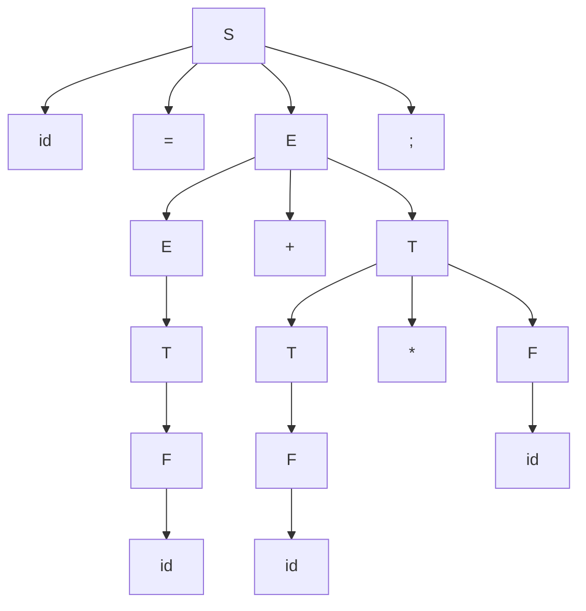

Understanding the distinct phases of a compiler—such as lexical analysis, syntax analysis, semantic analysis, optimization, and code generation—provides valuable insight into how source code is processed, errors are detected, and high-performance executable programs are created. This chapter will briefly explore each phase, illustrating how they contribute to the overall functionality of a compiler. and we will discuss a specific line from our [[Introduction to Compiler Design#|previous example]] and see how it transforms in each phase.

```c
x = a+b*c;
```

# 1. Lexical Analysis
---
The expression is first given to the analysis phase, and the **Lexical Analyzer** takes **_Lexemes_** as inputs and generates **_Tokens_**.

- **Lexemes**: A lexeme is a sequence of characters in the source code that matches a defined pattern for a specific component of the programming language (e.g., keywords, identifiers, operators, literals).
- **Tokens**: A token is an abstract representation or label assigned to a lexeme. Tokens are the output of the lexical analysis phase and are categorized into types such as `KEYWORDS`, `IDENTIFIERS`, `OPERATORS`, `LITERALS`, or `DELIMITER`.

| Lexemes | Tokens       |
| ------- | ------------ |
| x       | `IDENTIFIER` |
| =       | `OPERATOR`   |
| a       | `IDENTIFIER` |
| +       | `OPERATOR`   |
| b       | `IDENTIFIER` |
| *       | `OPERATOR`   |
| c       | `IDENTIFIER` |
>[!note] Note
>The **Lexical Analyzer** can recognize tokens using **_Regex_** (Regular Expressions).
>
>E.g. Regex for `IDENTIFIER`:
>
>`|(l+d)_(l+d*`
> - **l** : letter
> - **d** : digit
> - **_** : underscore


# 2 Syntax Analysis
---
In this particular phase (or parsing), the code `x = a+b*c` is analyzed to ensure it adheres to the grammatical rules of the programming language. The **Syntax Analyzer** (or parser) processes this line by line building a **parse tree** or **abstract syntax tree (AST)**, which represents the structure of the expression according to the rules of the language's grammar.

## 1.2 Input from the Lexical Analyzer

The Syntax Analyzer receives a **stream of tokens** from the [[Different Phases of a Compiler#1. Lexical Analysis|Lexical Analyzer]]. to begin it's process.

## 2.2 Grammatical Rules of the Language

The Syntax Analyzer uses a **context-free grammar (CFG)** to validate the structure of the statement. For example, a simplified grammar to expressions might include rules like:

```mathematica
S -> id = E ;
E -> E + T|T
T -> T * F|F
F -> id
```

*whereas*:
 - S: Start
 - id: identifier
 - E: expression
 - T: Term
 - F: Factor

These rules dictate how tokens can be combined to form a valid statement.

## 2.3 Parsing Process

The parser uses the grammar rules to break down the tokens into structured representation.
Common parsing techniques include:
- **Top-down Parsing** (e.g., recursive descent).
- **Bottom-up Parsing** (e.g., shift-reduce parsing)

for `x = a + b * c`, the parser:
1. Identifies `x = a + b * c` as an assignment expression.
2. Recognizes `a + b * c` as a mathematical expression.
3. Analyzes the mathematical expression according to operator precedence and associativity rules:
	1.  `*` ( multiplication) has higher precedence than `+` (addition).
	2. So, the parser first evaluates `b * c` and then adds `a`.

## 3.4 Building the Parsing Tree

The parser constructs a **parse tree** based on the grammar and operator precedence.




In order to find the **yield** of the parse tree The analyzer traverses the parse tree **Top-To-Bottom, Left-To-Right** taking notes of only the **Terminals** [^1]

Therefore, The **yield** of the above parse tree would be: `id = id + id * id ;`

and since the yield of the parse tree and the expression are the same, the Syntax Analyzer will not produce any errors.

# 3. Semantic Analysis
---
in the **Semantic Analysis** phase, the compiler checks whether the program is *meaningful* and adheres to the language's semantic rules. This phase operates on the **Abstract Syntax Tree (AST)** or **parse tree** produced by the Syntax Analyzer. For our example, the Semantic Analyzer performs several key tasks:

## 3.1 Type Checking

The Semantic Analyzer verifies that the types of the variables and operations are compatible.
This includes:
- Checking the type of `x`, `a`, `b` and `c`.
- Ensuring that `+` and `=` operations are valid for these types.

>[!note] For Example:
> - if `x` is declared as `int`, and `a`, `b`, `c` are integers, the assignment is valid.
> - if `x` is an integer but `a` is a `float`, the compiler may issue a warning or performs implicit type conversion if the language allows it.
> - If `b` or `c` were strings, the Semantic Analyzer would flag an error because multiplication (`*`) is not defined for strings in most languages.

## 3.2 Variable Declaration Check

The analyzer ensures that all variables used in the expression (`x`, `a`, `b`, `c`) are declared before use.

>[!note] For Example:
>If `b` is not declared in the code before this line, the Semantic Analyzer would report an undeclared variable error.

## 3.3 Scope Resolution

The Semantic Analyzer determines the scope of each variable and ensures that it is being used in the correct context. It check if:
- The variables, `x`,`a`,`b`, and `c` are accessible in the current scope.
- There are no conflicting variable names in the same scope.

>[!note] For Example:
>If `x` is declared in the different block or scope, and the current scope does not have access to it, the analyzer would raise an error.


## 3.4 Operator Overloading

For languages that support operator overloading, the analyzer verifies whether `x` and `*` operators are valid for the types of `a`, `b` and `c`.

>[!note] For Example:
>If `a`, `b`, or `c` are user-defined objects (e.g., in C++), the analyzer checks whether `+` and `*` are overloaded for these objects. If not, it raises an error.


## 3.5 Constant Folding (Optional)

The Semantic Analyzer may perform constant folding, which involves evaluating constant expressions during compile time to simplify them.

>[!note] For Example:
>If `b = 2` and `c = 3` are constants, the expression `b * c` can be replaced with `6`, simplifying the AST.


## 3.6 Assignment Compatibility

The Semantic Analyzer checks whether the expression on the right-hand side of the assignment is compatible with the variable on the left-hand side.

>[!note] For Example:
>If `x` is an integer and the result of `a + b * c` is a floating-point value, the compiler might:
>- Allow the assignment with a warning about truncation.
>- Perform an implicit cast (e.g., `float` to `int`).
>- Raise an error if implicit casting is not allowed.

## 3.7 Semantic Errors

If the Semantic Analyzer encounters an error, it halts compilation and reports it with details about the location and nature of the problem. Possible errors for the code include:
- Using undeclared variables.
- Type incompatibility (e.g., assigning a `string` to an `int`).
- Invalid operations (e.g., multiplying strings).

## Output of Semantic Analysis

In the case where no **semantic errors** had occurred the Semantic Analyzer produces a **Semantically Verified Parse Tree ( Or Abstract Syntax Tree (AST) )** which gets passed down to *Intermediate Code Generation*.

# 4. Intermediate Code Generation
---
This phase takes the [[Different Phases of a Compiler#Output of Semantic Analysis| Semantically Verified Parse Tree (Abstract Syntax Tree)]] generated by the **Semantic Analyzer** and can construct an explicit low-level or machine like **Intermediate Representation (IR)**, which we can think of as a program for an abstract machine. This representation should has two important properties:
- Easy to produce.
- Easy to translate into the target machine.

The representation we will be discussing is called **Three-Address Code (TAC)**[^2]

```mathematica
t0 = b + c;
t1 = a + t0;
x = t1;
```

>[!note] Keep in Mind:
> - Each three-address assignment instruction has at most one operator on the right-hand side. Therefore, these instructions fix the order in which operations are to be done.
> - The compiler must generate a temporary name to hold the value computed by a three-address instruction.
> - some "three-address intstructions" have fewer tan three operands (Like *line 3* in our example)


# 5. Code Optimization
---
The **Code Optimization** phase improves the intermediate code's performance or efficiency without altering the program's functionality. it focuses on reducing execution time, memory usage, or power consumption while maintaining correctness.

## Machine-Independent Optimization

These optimizations are general and do not depend on the target machine's architecture. They improve the code at a higher level, often on the **Intermediate Representation (IR)**.

Examples include:
- **Constant Folding**: Evaluating constant expressions at compile time (e.g., replacing `2 + 3` with `5`).
- **Dead Code Elimination**: Removing code that has no effect on the program's output.
- **Loop Optimization**: Techniques like **loop unrolling** or **loop invariant code motion** (moving calculations outside loops).

## Machine-Dependent Optimization

These optimizations tailor the code to the specific features of the target machine to maximize hardware efficiency.

Examples include:
- **Register Allocation**: Efficiently using the limited number of CPU registers.
- **Instruction Scheduling**: Arranging instructions to minimize delays (e.g., pipeline stalls).
- **Use of Specialized Instructions**: Leveraging hardware-specific instructions like vector operations or SIMD (Single Instruction, Multiple Data).

we can Reduce the number of three-address instructions in our example by assigning `a + t0` immediately into `x` and end up in with two "three address instructions" instead of three.

```mathematica
t0 = b * c;
x  = a + t0;
```

# 6. Target Code Generation
---
The **Code Generator** translates the optimized *Intermediate Representation (IR)[^3]* into **machine code** or **binary code** that can run directly on the target hardware. This is the final phase of the compilation process.

```assembly
mov    eax, DWORD PTR [rbp-8]
imul   eax, DWORD PTR [rbp-12]
mov    edx, eax
mov    eax, DWORD PTR [rbp-4]
add    eax, edx
mov    DWORD PTR [rbp-16], eax
```


---
[^1]: Terminals are the basic, indivisible symbols of a language. These are actual token produced by the lexical analyzer ( lexer ), such as keywords, identifiers, operators, literals and punctuation. Whereas **Non-Terminals** are the **intermediate symbols**  in the grammar that define the structure and the hierarchy of the language. They are placeholders for patterns or structures that can be expanded into terminals or other non-terminals (e.g., Expression, Statement, Term, Factor)

[^2]: **Three-Address Code (TAC)** consists of sequence of *assembly-like* instructions with three operands per instruction. Eachc operand can act like a register.

[^3]: Or in some cases assembly code.